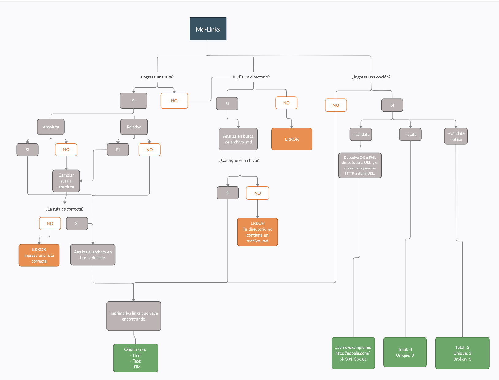

# Xsamynox Markdown Links

## Índice

* [1. Md-Links](#1-md-links)
* [2. Flujo](#2-flujo)
* [3. Comenzando a usarla](#3-comenzando-a-usarla)
* [4. Herramientas y Librerias Utilizadas](#4-herramientas-y-librerias-utilizadas)
* [5. Autor](#5-autor)

***

## 1. Md-Links

**¿Qué es Md-Links?**

Md-Links es una libreria que lee y analiza archivos en formato **MARKDOWN**  para verificar los links que contengan y reportar algunas estadísticas.

Puedes conocerla y probarla [aquí](https://comida-paratodos.web.app/).
## 2. Flujo

Para la implementación de Md-Links se creo un flujo que explica el funcionamiento de la libreria.

## 3. Comenzando a usarla 🚀

## 4. Herramientas y Librerias Utilizadas 🛠️

En éste proyecto fueron utilizadas varias herramientas y librerias para llegar al resultado del producto entregado.
Las herramientas usadas fueron:

* [Creately.](https://app.creately.com/diagram/yKVuqoX0LcV/edit) – Para el flujo de la libreria.
* [Trello](https://trello.com/b/SlpQ5I8n/md-links-%F0%9F%94%97) – Para la planificación.
* [Git y GitHub](https://github.com/xsamynox/SCL014-md-links) – Para guardar las versiones de trabajo.
* [Node](https://nodejs.org/es) – Para el entorno de ejecución de JavaScript.
* [Markdown-it](https://github.com/markdown-it/markdown-it) – Para pasar el archivo .md a HTML.
* [JSDOM](https://github.com/jsdom/jsdom) – Para crear un dom que se encargue de buscar las etiquetas '<a>'.
* [Fetch](https://www.npmjs.com/package/fetch) – Para extraer el contenido de los links/urls.

## 5. Autor ✒️

* **Samantha Moreno** [GitHub](https://github.com/xsamynox) :octocat: - Front-end Developer
